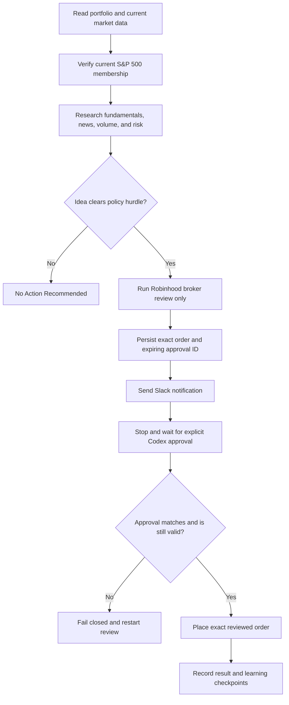

# AI CIO Trading Tools

A safety-gated AI Chief Investment Officer workflow using Alpaca for paper trading, Robinhood for live trading,
and Slack for notifications.

The project helps review a portfolio, research eligible stocks, prepare broker order reviews, send approval notifications, and learn from outcomes. It is intentionally designed to stop before real execution unless every approval requirement is satisfied.

See [ROADMAP.md](ROADMAP.md) for completed capabilities, remaining operational proof, and the recommended path to a limited live pilot.
See [docs/upstream_review.md](docs/upstream_review.md) for the Qlib, NautilusTrader, LEAN, and OpenBB comparison
and the patterns deliberately adopted or rejected.

For unattended Slack reply monitoring, create a dedicated Slack app and keep both OAuth tokens only in
the local environment: a user token in `SLACK_USER_TOKEN` for `conversations.replies`, and a bot token
in `SLACK_BOT_TOKEN` for acknowledgements. Grant the user token `channels:history` (or `groups:history`
for a private channel) and grant the bot token only `chat:write`. Invite the app only to the configured
`SLACK_CHANNEL_ID`. `SlackWebApiReplyHost` rejects every other channel and exposes no broker or execution
operations.

## What This Project Does

- Routes paper account/orders exclusively to Alpaca's paper API.
- Reads authorized Robinhood account and portfolio information only in live mode.
- Restricts new purchases to verified current S&P 500 constituent companies.
- Evaluates fundamentals, valuation, news, volume, liquidity, momentum, volatility, and event risk.
- Produces structured Slack approval notifications.
- Formats Slack messages as compact decision summaries with separate order, rationale, market-quality, risk, source, and approval sections.
- Persists expiring approval records and prevents changed or duplicate orders.
- Tracks recommendations and outcomes in a learning journal.
- Coordinates the complete pre-trade workflow through one service.
- Keeps research, buy, monitoring, sell, profit reporting, and learning in one symbol-named lifecycle task.
- Uses SQLite for atomic approvals, audit events, exit plans, learning checkpoints, and reconciliation state.
- Supports safety-wrapped Alpaca paper and Robinhood live equity workflows.

## What It Does Not Do

- It does not treat a Slack message or Slack reply as trade approval.
- It does not place or cancel orders automatically.
- It does not buy options, crypto, leveraged ETFs, inverse ETFs, or non-S&P 500 stocks.
- It does not sell merely because a position has a small profit.
- It does not bypass broker review or explicit Codex approval.
- It does not store broker or Slack credentials in Git.

## Trading Modes and Kill Switch

The default `.env` is deliberately safe:

```env
TRADING_MODE=research_only
TRADING_ENABLED=false
```

`paper_auto` routes only to `https://paper-api.alpaca.markets`; an Alpaca live URL is rejected. It never falls
back to Robinhood or the local simulator. `live_approval` routes only to Robinhood and attaches the default-off
live kill switch. Changing a file is still not sufficient authorization: live placement continues to require an
agentic account, broker review, transactional approval, matching explicit Codex approval, and unchanged
parameters. `PaperTradingBackend` remains a connector-free test double for unit and failure testing only.

See [docs/alpaca_paper.md](docs/alpaca_paper.md) for paper-account setup and a read-only connection check.

## Safety Model

A real order requires all of the following:

1. The selected Robinhood account has `agentic_allowed=true`.
2. A purchase is verified against S&P 500 membership data observed within the last 24 hours.
3. Current market, news, fundamental, liquidity, volume, volatility, and event-risk information has been reviewed.
4. Robinhood returns a broker review without placing the order.
5. The exact reviewed order is stored under a unique approval ID.
6. The user explicitly approves that ID in Codex before it expires.
7. The account, symbol, side, size, prices, order type, time in force, and market-hours setting remain unchanged.
8. The approval has not already been used.

Any missing or changed requirement fails closed and requires a new broker review.

Slack is a notification channel only. It never authorizes execution.

Paper mode uses separate Alpaca paper credentials, storage, and simulated broker fills. It still preserves the
review, fingerprint, durable approval, and reconciliation workflow. Live mode never uses a configuration
variable as execution authority: `TRADING_ENABLED=true` only opens the Robinhood kill switch. Every live buy,
trim, or sell still needs a fresh broker review and explicit matching Codex approval. Slack `YES` requests
sizing, `NO` rejects the pending idea, and an amount triggers a fresh review in the same symbol task.

## One-Task Trade Lifecycle

Each active symbol has one durable lifecycle whose task name is exactly the uppercase ticker (for example,
`AAPL`). Duplicate lifecycle creation is blocked. The task progresses through research, buy approval, open
position monitoring, sell approval, filled sale, realized-profit Slack notification, and learning checkpoints.

Profit alone is not a sell signal. The exit evaluator considers thesis status, valuation, concentration,
target return, retracement from the peak, and upcoming binary events. Any resulting trim or sale is review-only
until the broker preview and matching Codex approval are complete.

## Investment Policy

### Eligible purchases

Only companies verified as current S&P 500 constituents may be purchased. Membership is dynamic, so the host must supply a current sourced snapshot instead of relying on a permanent hard-coded list.

Existing holdings outside the index may be held, trimmed, or sold to exit legacy exposure, but cannot be purchased or increased.

### Research requirements

Every candidate should include:

- A current broker quote with timestamp and source
- Current company news
- A current company filing, SEC filing, or investor-relations source
- At least one additional independent reliable source
- A clear thesis and counterargument
- Expected reward/risk better than 2:1
- Portfolio, concentration, and tax impact

### Volume and execution analysis

The workflow records:

- Current session volume
- 20-day and 50-day average volume
- Relative volume
- Average daily dollar volume
- Bid/ask spread
- Proposed order size relative to average volume
- Expected slippage
- Whether volume confirms or contradicts the price move

It also evaluates moving-average context, relative strength, RSI, realized volatility, ATR, drawdown, gap risk, upcoming earnings, filings, dividends, and other material events.

These signals provide confirmation and risk context. They are not standalone instructions to buy or sell.

### Profitable positions

The full portfolio is reviewed using cost basis, unrealized return, holding period, tax impact, thesis status, valuation, concentration, and position-specific targets.

A positive return triggers analysis—not an automatic sale. A trim or sale still requires broker review, a Slack notification, and explicit matching approval in Codex.

## Approval Lifecycle



## System Components

- `MarketSnapshot` captures a reproducible, hashed set of quotes, volume, liquidity, trend, volatility, event risk, and sourced research.
- `DecisionRecord` preserves immutable model, prompt, policy, snapshot, score, rationale, provider, effective-time, observation-time, and content-hash provenance without creating trading authority.
- `ReplaySnapshot` rejects observations that were unavailable at decision time, providing a look-ahead-bias guard for historical replay.
- `ResearchExperiment` records Qlib-style strategy hypotheses and paper runs with replay, dataset, artifact,
  parameter, policy, and code provenance; acceptance requires at least ten observations and a human reviewer.
- `TradeCandidate` fails closed when data is stale, critical signals are missing, source quality is inadequate, score is below the purchase hurdle, or reward/risk is insufficient.
- `RiskLimits` enforces position, sector, cash-reserve, daily-capital, pending-approval, spread, and market-impact limits.
- `CioWorkflow` connects validation, portfolio risk, broker review, approval persistence, Slack delivery, exit plans, audit events, and learning schedules.
- `CioDatabase` uses SQLite transactions and `BEGIN IMMEDIATE` execution reservation to prevent concurrent duplicate placement.
- `validate_policy_change` requires at least 10 comparable observations before a durable rule can be reconsidered.
- Uncertain broker failures enter `reconciliation_required`; they are not retried blindly.
- Structured JSON logs include correlation and approval IDs while excluding credential-like fields.
- Host adapter protocols provide market data, portfolio data, Robinhood, and Slack access without moving connector credentials into this repository.
- `operations-status` classifies database, reconciliation, drift, stale-run, delivery, health-route, learning, and emergency-stop state.
- Daily-run keys prevent duplicate morning summaries and approvals for the same account/date.
- Daily-run checkpoints allow stale interrupted screens to resume without rerunning a completed screen step.
- A standalone launchd watchdog reads automation completion memory outside the Desktop privacy boundary and sends one deduplicated health alert after a missed run.
- Broker-state drift checks block recommendations when positions, orders, fills, dividends, or corporate actions are not linked to durable lifecycle state.
- Shadow-equity records capture at most one paper-only qualifying idea (or no action) per day without creating a broker review or approval.
- Source-specific freshness manifests name missing or stale inputs, and settled-cash checks reserve unsettled funds plus pending-order commitments.
- Tax-lot helpers surface long/short-term holding context and wash-sale warnings as estimates.

## Project Layout

```text
config/
  approval_routes.json          Active routing and investment-policy settings
  approval_routes.example.json  Example configuration
docs/
  alpaca_paper.md               Paper-account setup, isolation, and read-only health check
  approval_automation.md        Daily CIO and approval workflow
  operator_runbook.md           Startup, shutdown, emergency, recovery, and restore procedures
  upstream_review.md            Primary-source comparison with similar open-source systems
  robinhood_trading_tools.md    Robinhood adapter and safety details
  slack_required_tools.md       Slack tool and destination requirements
ROADMAP.md                      Evidence-based delivery and operating roadmap
robinhood_tools/
  alpaca_paper.py               Alpaca paper-only HTTP transport and equity backend
  analysis.py                   Market snapshots, source controls, candidates, exit plans
  approvals.py                  Durable approval ledger and order fingerprints
  auth.py                       Connector authorization checks
  database.py                   Transactional SQLite approval and audit database
  governance.py                 Immutable decision provenance and content-addressed IDs
  observability.py              Local operational status and severity checks
  replay.py                     Point-in-time replay evidence validation
  research.py                   Immutable experiment, run, metric, and promotion records
  daily_controls.py             Freshness, broker drift, watchdog, daily changes, and notice rendering
  health.py                     Fixed-route Slack health notifier for local operations
  adapters.py                   Credential-free host integration boundaries and Slack retries
  cli.py                        Safe maintenance and read-only command-line interface
  journal.py                    Durable JSON-lines workflow journal
  market_calendar.py            Authoritative exchange-session validation boundary
  paper.py                      Connector-free simulated broker
  portfolio.py                  Tax-lot ranking and wash-sale warnings
  privacy.py                    Safe support-bundle creation
  runtime.py                    Configuration factory and live kill switch
  logging.py                    Redacted structured JSON logging
  learning.py                   Outcome attribution and policy-change evidence gate
  mcp_backend.py                Robinhood MCP argument/result adapter
  models.py                     Accounts, requests, reviews, and orders
  notifications.py              Slack delivery-attempt records
  policy.py                     Account and order validation rules
  risk.py                       Portfolio-level hard risk limits
  service.py                    Main safety-gated trading service
  universe.py                   Current S&P 500 membership validation
  workflow.py                   End-to-end CIO workflow coordinator
scripts/
  encrypted_backup.sh            Encrypts database backups without committing them
  check_required_tools.py       Checks configured Slack capabilities
  dashboard.py                  Generates the read-only local dashboard
  health_check.py               Non-posting route and access health check
  restore_drill.py              Non-destructive database restore verification
  install_watchdog.py           Installs the privacy-safe launchd watchdog and Keychain token
  standalone_watchdog.py        Dependency-free missed-run checker used outside Desktop
  render_approval_message.py    Produces complete approval-notification text
  secret_scan.py                Rejects credential-like content in tracked files
  update_journal.py             Appends schema-validated strategy observations
tests/                           Unit and workflow safety tests
mcp.json                        Robinhood MCP server configuration
Makefile                        Common test and health commands
pyproject.toml                  Python project metadata
```

## Configuration

Personal values live in the git-ignored `.env` file. The shareable template is [`.env.example`](.env.example). Copy the template when setting up another machine or sharing the project:

```bash
cp .env.example .env
```

Then edit `.env` with the local timezone, Slack channel, account nickname, and non-secret investment context. The active policy configuration is [`config/approval_routes.json`](config/approval_routes.json); it contains `${VARIABLE_NAME}` references instead of personal values.

Never put Robinhood account numbers, passwords, cookies, access tokens, recovery codes, or live-broker API keys
in `.env`. Authentication remains inside the authorized Robinhood and Slack connectors. Alpaca paper keys may
be injected through the process environment or a local secret manager. The ignored `.env` is supported for
paper-only keys when restricted to the local user with `chmod 600 .env`; never commit, paste, or share it.

Important settings include:

- `approval_window_minutes`: how long a reviewed approval remains valid
- `channels.slack.channel_id`: fixed Slack destination
- `channels.slack.required_tools`: tools required in the same CIO task
- `investment_policy.purchase_universe`: eligible purchase universe
- `membership_max_age_hours`: maximum age of membership evidence
- `minimum_independent_research_sources`: minimum source count
- Volume, execution, trend, volatility, and event-analysis requirements
- Learning checkpoints and minimum evidence before changing policy

Do not put credentials, account numbers, or private tokens in this file.

### Sharing safely

Share the repository and `.env.example`, but never share `.env`. Before publishing or sending the project, confirm `.env` is ignored:

```bash
git check-ignore .env
```

The `.gitignore` also excludes approval ledgers, delivery logs, runtime outputs, virtual environments, and Python caches.

## Running the Tests

The test suite uses the Python standard library and does not contact Alpaca or Robinhood or place orders.

```bash
make test
```

Equivalent command:

```bash
python3 -m unittest discover -s tests -v
```

The suite covers account restrictions, broker-review requirements, approval expiry, order tampering, duplicate execution, S&P 500 purchase restrictions, Slack delivery records, message formatting, and learning-journal fields.

The production-hardening tests also cover paper fills, the live kill switch, database backup/integrity, duplicate daily-run blocking, Slack retry behavior, market-calendar failures, tax-lot ordering, wash-sale warnings, and privacy-safe exports.

## CLI

Install the project or use the module directly:

```bash
python3 -m robinhood_tools.cli health
python3 -m robinhood_tools.cli paper-broker-health
python3 -m robinhood_tools.cli operations-status
python3 -m robinhood_tools.cli daily-review --account-label Agentic
python3 -m robinhood_tools.cli watchdog --account-label Agentic --database outputs/live/cio.db
python3 -m robinhood_tools.cli recovery-plan
python3 -m robinhood_tools.cli shadow-recommendations
python3 -m robinhood_tools.cli lifecycles
python3 -m robinhood_tools.cli research-experiments
python3 -m robinhood_tools.cli approvals
python3 -m robinhood_tools.cli dashboard
python3 -m robinhood_tools.cli backup outputs/backups/cio.db
python3 -m robinhood_tools.cli support-bundle outputs/support.zip
python3 -m robinhood_tools.cli emergency-stop
python3 -m robinhood_tools.cli emergency-resume
```

There is intentionally no casual `buy` command.

### Small-account safety profile

The checked-in policy limits new orders to $25, preserves at least $50 cash, permits one open position,
stops new entries after $5 daily or $10 weekly realized loss, blocks entries within five days of earnings,
and applies a five-trading-day cooldown after an invalidated loss. Risk-off markets require a higher candidate
score, and all critical data inputs must be present and fresh.

`emergency-stop` durably blocks new reviews and placements. It does not cancel orders or liquidate positions.
Only an explicit operator action may call `emergency-resume`. Paper and live modes use separate databases and
dashboards under `outputs/paper/` and `outputs/live/`. Approval messages include a short immutable order
fingerprint so changed parameters are visible.

### Recovery and immutable audit

Back up the database before every migration. Export approvals, research snapshots, fills, lifecycle events,
and learning records with `export_audit_bundle`; the adjacent SHA-256 file detects changes. Encrypt backups
using operating-system or organization-approved encrypted storage and never commit them.

Test recovery quarterly on a clean machine: install from the lockfile, restore the correct paper or live
database, run `cio migrate`, verify integrity, resume unexpired Slack monitors, render the dashboard, and keep
live trading disabled until every check passes.

Use `python3 -m scripts.restore_drill BACKUP.db` for a non-destructive first-line restore verification. It
restores to a temporary location and checks integrity, schema, required tables, and source immutability. Follow
the full startup, incident, encrypted-backup, and credential procedures in `docs/operator_runbook.md`.

`daily-review` is safe without host adapters: it claims exactly one run per account/date, persists restart
checkpoints, records a shadow no-action observation, and reports `No Action Recommended`. In the connected
host, supply current freshness evidence, reconciled broker state, and screened ideas. A research-qualified
candidate may be recorded in the shadow portfolio even when an execution gate blocks a live review; shadow
activity never creates an approval or broker call. Qualified executable symbols resume or create their single
ticker lifecycle. Broker and market credentials never enter the CLI or repository.

### Operating modes

- `research_only`: screen, research, journal, and notify; never create a broker service.
- `paper_auto`: Alpaca paper account, reviews, and simulated fills; never Robinhood or Alpaca live.
- `live_approval`: Robinhood live reviews and placements, with the kill switch plus matching Codex approval.

Legacy `paper` and `live` values normalize to `paper_auto` and `live_approval`.

Configuration is strict in runtime startup. Unknown, misspelled, missing, or stale keys fail closed, and the
configured database schema version must match the code. This prevents a typo from silently disabling a safety
setting. Broker routing is also fixed: `paper_broker=alpaca` and `live_broker=robinhood`.

### Restart and fill safety

Symbol leases prevent two workers from monitoring the same open lifecycle concurrently and expire so a
replacement worker can recover after a crash. Broker fills are stored by `(order_id, fill_id)`, making repeated
reconciliation idempotent. Partial fills use a weighted average price and accumulated fees. Realized profit uses
allocated tax-lot cost basis, actual fill proceeds, and fees before Slack reports a final result.

Run `cio recovery-plan` at startup. Recovery order is: resume unexpired Slack windows, reconcile uncertain
broker approvals, then reclaim a stale daily run and reuse any completed screen checkpoint. Before a new
recommendation, compare current positions, open orders, fills, dividends, and corporate actions with durable
ticker lifecycle state. Any unexplained difference blocks the recommendation until reconciled.

### Independent missed-run watchdog

Install the separate weekday 10:05 ET watchdog with:

```bash
python3 scripts/install_watchdog.py
```

The installer copies a dependency-free checker to `~/Library/Application Support/OpenAI-AICIO-Watchdog`,
stores the Slack bot token in the login Keychain, and loads `com.openai.ai-cio-watchdog`. The background job
reads the automation memory under `$CODEX_HOME`, avoiding macOS background access restrictions on Desktop.
It posts to `HEALTH_SLACK_CHANNEL_ID` only when the 09:45 review is still incomplete after the configured grace
period, and deduplicates one alert per automation/date. This detects a missed run; it does not execute a trade.

To verify the real Keychain and Slack route with one explicitly labeled, non-trading test message, run:

```bash
python3 scripts/install_watchdog.py --test-alert
```

The test does not create an approval, recommend a security, change missed-run deduplication state, or authorize
broker activity.

## CI and Quality

GitHub Actions installs the exact top-level development tool versions and audited transitive security floors
in `requirements-dev.lock`, then runs
unit/integration tests, Ruff, mypy, coverage, configuration validation, dependency audit, and local secret
scanning. Dependabot checks Python and GitHub Actions dependencies weekly. Run the dependency-free local subset with:

```bash
make ci
```

## Health Check

For Alpaca paper mode, first run the read-only broker check:

```bash
python3 -m robinhood_tools.cli paper-broker-health
```

Authenticated paper-account access was verified with this command on 2026-07-14. That evidence proves only
the configured environment's read-only account connection; it does not prove order placement or authorize a
trade. The first smoke test also verified zero broker drift and that live-Alpaca, Robinhood-live, and option
paths remain blocked in paper mode. Because the market was closed, the order stage correctly stopped before
candidate review when five-minute quote, spread, and volume freshness could not be satisfied.

For Robinhood live mode, after the host independently verifies Robinhood read access, run:

```bash
make health
```

This validates configuration and declared Slack capability without posting a Slack message.

## Local Dashboard

Generate a read-only operational dashboard:

```bash
make dashboard
```

The output defaults to `outputs/dashboard.html` and summarizes approval states and overdue learning checkpoints. The `outputs/` directory is ignored by Git.

## Automated Reviews

The operating setup includes a daily AI-CIO review and a monthly performance report. These are Codex automations, not credential-bearing processes in this repository; recreate or inspect them in Codex when installing on another machine. A review can also be run manually in the current Codex task. Daily runs must check an official current U.S. exchange calendar and skip exchange holidays or special closures without posting to Slack.

The daily review owns the complete lifecycle for a selected ticker in one task: research, broker preview, Slack notification and event-scoped reply monitoring, matching Codex approval, placement, reconciliation, exit review, and final profit/loss notification. It must not create another task for the same trade. The monthly report summarizes realized and unrealized performance, benchmark-relative outcomes, execution quality, risk-limit events, and overdue learning checkpoints. Neither automation may weaken the live approval gate.

On an open day it performs a read-only portfolio and market review, then sends one readable Slack summary with:

- `ACTION`, `WHAT YOU SHOULD DO`, `WHY`, `NEXT REVIEW`, and live-trading status first
- `CHANGED SINCE YESTERDAY` and source-specific `DATA AS OF` timestamps
- Market status and portfolio-health verdict
- Cash, concentration, and risk summary
- Recommended actions or `No Action Recommended`
- Key risks and source links
- A structured broker-reviewed approval section only when a trade clears every hurdle
- Any blocked candidates under `WATCHLIST ONLY — NOT A BUY RECOMMENDATION`

The review never places or cancels an order automatically. Slack remains notification-only.

Trade approval messages also show current buying power, proposed cost, estimated buying power remaining, and the exact reviewed dollar/share sizing. If funds are insufficient, Slack receives a `No Approval Created` notice showing the shortfall. The user must return to Codex and specify a smaller exact dollar amount or share quantity for a fresh broker review; changing size in Slack is not accepted as execution approval.

## Slack Reply Window

There is no continuous Slack-monitor automation. When an AI CIO approval message is sent, the same active Codex task opens a 10-minute reply window and checks only that message/thread during the window. It recognizes:

- `TEST SIZE $50`
- `TEST SHARES 0.25`
- `TEST REJECT`
- `YES` — asks for exact dollar/share sizing but does not approve
- `NO` — rejects the linked pending, unexecuted approval
- `$50` or `0.25 shares` — parses sizing and redirects to Codex for affordability checks and broker review

Processed messages are deduplicated in SQLite by channel and Slack timestamp. If no response arrives in 10 minutes, the linked pending approval is rejected. Temporary reply-window state is deleted after rejection, cancellation, or execution. Approval, buy, sell, and other execution-like Slack commands are explicitly blocked and acknowledged as non-executable. Real sizing, broker review, and approval remain Codex-only.

The event-scoped monitor remains in the same active Codex task for the 10-minute window. It does not create additional scheduled Codex tasks.

After a matching Codex-authorized placement, Slack may report `Trade successful` only when the selected broker
returns a filled result. A queued or confirmed order must be described as submitted, not successful or filled.

For the lower-level tool check:

```bash
python3 scripts/check_required_tools.py \
  --available-tools slack._slack_send_message
```

## Rendering a Test Approval Message

`scripts/render_approval_message.py` requires complete order, pricing, volume, execution, risk, and research information. It only prints text; it does not send a message or contact Robinhood.

Run its help command to see all required fields:

```bash
python3 scripts/render_approval_message.py --help
```

Never substitute simulated values into a real approval request. Label test data clearly and use a non-executable approval ID.

## Learning Journal

The AI CIO journal records the original thesis and market conditions, then evaluates results after 1, 5, and 20 trading days.

The separate shadow-equity table records at most one qualifying paper candidate or explicit no-action observation
per daily run. It uses the same research, universe, earnings, freshness, and regime requirements, but it cannot
create broker reviews, Slack approvals, or live orders. Shadow outcomes are measured against both the underlying
equity decision and the S&P 500 so the one-position live cap does not stop evidence collection.

Learning fields include:

- Outcome and S&P 500 benchmark return
- Excess return
- Thesis accuracy
- Volume and trend assumptions
- Execution slippage
- Lessons and error attribution

Durable policy should not change after one winner or loser. The configured process requires at least 10 comparable observations and a repeated pattern before changing a scoring weight or rule.

Strategy research is registered separately from trading. An experiment records its baseline, proposed version,
Git commit, policy and parameter hashes, point-in-time replay digest, expected benefit, and rollback criteria.
Only paper-status experiments accept runs. Each run must include dataset/artifact hashes and excess-return,
drawdown, turnover, and slippage metrics. Research acceptance requires the configured observation minimum and
a recorded human reviewer; it never changes live policy or creates broker authority automatically.

Append a portable observation with `python3 scripts/update_journal.py outputs/learning.csv --symbol AAPL ...`. The helper enforces the complete documented CSV schema and refuses to append to an incompatible older header. When durable workflow behavior changes, update this README and the installed `ai-cio-portfolio-manager` skill in the same change, then validate both.

## Live-Use Checklist

Before a live CIO task:

- Attach Robinhood and Slack to the same Codex task.
- Confirm Robinhood read tools and Slack send are exposed.
- Use only the explicitly selected agentic Robinhood account.
- Refresh S&P 500 membership evidence and market data.
- Review the full portfolio before recommending a transaction.
- Run broker review before creating an approval request.
- Confirm the Slack message contains the exact reviewed details.
- Stop before execution and wait for matching explicit Codex approval.

When evidence is incomplete or no idea clears the hurdle, the correct result is **No Action Recommended**.
